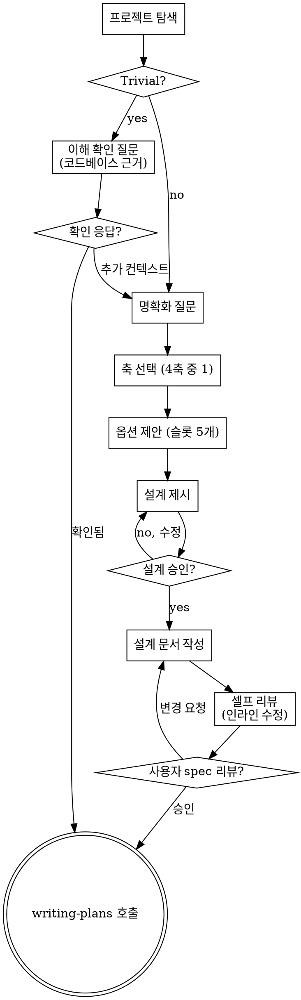

# Brainstorming Ideas Into Designs (Deep-Kiss)

아이디어를 자연스러운 협업 대화를 통해 완성된 설계와 명세로 전환합니다.

**Deep-Kiss 의미**: 의도와 제약은 *깊게* 파헤치되, 결과로 내놓는 옵션들은 모두 *KISS 영역 안*에 있어야 한다. 모든 옵션은 작아야 하며, 차이는 "얼마나 큰가"가 아니라 *"어떤 종류의 최소냐"*다.

먼저 현재 프로젝트 컨텍스트를 이해하고, 한 번에 한 가지씩 질문하여 아이디어를 다듬는다. 무엇을 만드는지 이해하면 설계를 제시하고 사용자 승인을 받는다.

<HARD-GATE>
설계를 제시하고 사용자가 승인하기 전까지 어떠한 구현 스킬도 호출하지 말고, 코드 작성·프로젝트 스캐폴딩·구현 액션을 하지 말 것. 단순해 보이는 프로젝트도 예외 없음.
</HARD-GATE>

## 이 스킬의 자기 규율 (Meta-YAGNI)

이 스킬도 YAGNI를 따른다:

1. **원칙을 인코딩하지 케이스를 인코딩하지 않는다.** 새 시나리오가 떠오르면 기존 원칙으로 커버되는지 먼저 확인. 안 되면 *원칙*을 추가하지 *케이스 카탈로그*를 늘리지 않음.
2. **예시는 *형식*을 가르치는 도구**이지 *상황*을 망라하는 카탈로그가 아니다. 3개 이상으로 늘리지 않음.
3. **이 스킬을 처음 읽는 작은 모델도 따라할 수 있어야 한다.** 모호한 표현·암묵적 가정을 발견하면 명시적으로 고친다.

## Anti-Pattern: "이건 디자인 필요 없을 만큼 단순해"

모든 프로젝트는 이 절차를 거친다. todo 리스트, 단일 함수 유틸, 설정 변경 — 전부. *"단순한"* 프로젝트가 검증되지 않은 가정으로 가장 많은 낭비를 만든다. 디자인은 짧아도 되지만 (정말 단순한 프로젝트는 몇 문장), 반드시 제시하고 승인을 받아야 한다.

## 체크리스트

다음 항목 각각에 task를 만들고 순서대로 완료할 것:

1. **프로젝트 컨텍스트 탐색** — 파일·문서·최근 커밋
2. **시작 점검 (Trivial 빠른 경로)** — 해당 시 코드베이스 근거를 담은 *이해 확인 질문*
3. **명확화 질문** — 한 번에 하나씩, 목적·제약·성공 기준 이해
4. **축 선택** — 4가지 축(범위/위치/추상화/제거) 중 작업에 맞는 1개
5. **2~3개 옵션 제안** — 선택한 축의 위치들로, 5개 필수 슬롯 채워서
6. **설계 제시** — 복잡도에 맞춰 분량 조절, 각 섹션 후 승인 받기
7. **설계 문서 작성** — `docs/deep-kiss/specs/YYYY-MM-DD-<topic>-design.md`에 저장 후 커밋
8. **명세 셀프 리뷰** — placeholder/모순/모호함/스코프 인라인 점검
9. **사용자 명세 리뷰** — 작성된 spec을 사용자가 검토
10. **구현 단계 전환** — `writing-plans` 스킬 호출

## Process Flow

**최종 상태는 `writing-plans` 호출이다.** `frontend-design`, `mcp-builder` 등 다른 구현 스킬을 호출하지 말 것. brainstorming 다음 *유일한* 스킬은 `writing-plans`.

## Trivial 빠른 경로 (시작 점검)

요청이 *정확한 변경*을 명시했고 영향 범위가 *명백히 1곳*이면, 옵션 생성·축 선택을 건너뛰되 **이해 확인 질문**을 반드시 던진다. 모호하면 정상 흐름으로 복귀.

이해 확인 질문은 *코드베이스 탐색을 거친 근거*를 포함해야 한다 — "직접 구현"으로 바로 넘어가지 않는다:

- ❌ "오타 수정만 하시면 되는 거죠?" *(근거 없음. 무엇을 어디서 수정하는지 모름)*
- ✅ "`src/utils/format.ts:42`의 `convertd` → `converted` 오타 수정 한 줄만 말씀하신 거 맞나요? 같은 파일에 다른 의심스러운 식별자는 못 찾았습니다."
- ✅ "제가 이해한 건 `LegacyAdapter` 클래스를 `src/payment/adapters/legacy.ts`에서 제거하는 것이고, `rg LegacyAdapter`로 호출처가 0건임을 확인했습니다. 맞나요?"

확인을 받으면 정상 흐름의 후반부로 합류 (writing-plans 호출 또는 사용자가 합의한 직접 편집). 추가 컨텍스트가 나오면 명확화 질문 단계로 복귀.

## The Process

### 아이디어 이해

- 먼저 현재 프로젝트 상태 확인 (파일·문서·최근 커밋)
- 자세한 질문 전에 **스코프 평가**: 요청이 여러 독립 서브시스템(예: "채팅 + 파일 저장 + 결제 + 분석을 갖춘 플랫폼")을 묘사하면 즉시 플래그. 분해가 먼저 필요한 프로젝트의 세부사항을 다듬는 데 질문을 낭비하지 않는다.
- 하나의 spec에 담기 너무 크면 **서브 프로젝트로 분해**: 독립적인 부분은 무엇이고, 어떤 관계이며, 어떤 순서로 만들지. 그 후 첫 서브 프로젝트를 정상 디자인 흐름으로 brainstorm. 각 서브 프로젝트는 자체 spec → plan → implementation 사이클.
- 적절한 스코프의 프로젝트는 한 번에 한 질문으로 다듬기
- 가능한 한 객관식 질문 선호. 오픈 엔드도 가능
- 메시지 당 질문 1개. 한 주제가 더 깊은 탐색이 필요하면 여러 질문으로 나눔
- 초점: 목적·제약·성공 기준

### 옵션 탐색 (KISS-Locked)

**핵심 원칙**: 모든 옵션은 KISS 영역 안에 있어야 한다. 차이는 "얼마나 큰가"가 아니라 *"어떤 종류의 최소냐"*. "확장 가능", "미래 대비", "범용" 같은 옵션은 *그 자체로 룰 위반*.

#### 1단계: 4축 중 1개 선택

작업 종류로 축을 결정. *각 축의 모든 옵션은 KISS 영역 안*에 있다.

**범위 축** — 작업이 *추가/수정*이고 영향 범위가 결정 사항일 때
- *정확*: 요청된 것만, 한 곳만 변경. 인접 코드 안 건드림
- *인접*: 요청된 것 + 같이 안 건드리면 깨지는 1-2곳까지
- *경계*: 요청된 것 + 명백히 같은 단위까지 (같은 함수, 같은 짧은 파일)

**위치 축** — 새 동작의 *자리*가 결정 사항일 때
- *인플레이스*: 기존 함수/블록 안에서 해결
- *얇은 헬퍼*: 같은 파일에 작은 함수 1개
- *격리된 작은 단위*: 새 파일 1개로 분리 (다른 데 영향 0)

**추상화 축** — *반복/성장*하는 코드를 다룰 때
- *인라인 반복*: 추상화 0, 그냥 두 번 쓴다 (rule of three 미도래)
- *단일 헬퍼*: 함수 하나로 묶음
- *단일 타입/인터페이스*: 작은 타입 1개 도입 (KISS 상한선)

> ❗ "더 큰 추상화" (제너릭 베이스 클래스, 플러그인 아키텍처, 추상화 계층 추가)는 옵션에 포함 금지. 위 3개가 KISS 영역의 상한 — **단, 아래 "Rule of Named Two" 예외 충족 시 별도 절차로 진행**.

##### 추상화 축 예외: Rule of Named Two

추상화 축의 상한선은 *모호한 미래 대비*(YAGNI 위반)를 막기 위한 것이지, *기획 레벨에서 확정된 확장*까지 막는 것은 아니다. 다음 **기계적 테스트**를 통과하면 더 큰 추상화(인터페이스/팩토리)를 옵션에 포함할 수 있다:

> **Rule of Named Two**: 지금 시점에 *구체적으로 명명된* 인스턴스가 ≥ 2개 존재해야 한다.
>
> - ✅ "카카오 OAuth2 + 다음에 구글, 네이버 추가 예정" — 명명된 3개
> - ✅ "MySQL 어댑터 + 다음 마이그레이션은 Postgres" — 명명된 2개
> - ❌ "확장 가능한 OAuth2" — 0개 (*"확장 가능"은 모호한 표현, 그 자체로 테스트 실패*)
> - ❌ "다양한 인증 제공자 지원" — 0개 ("다양한" / "여러" 동일하게 실패)
> - ❌ "OAuth2 로그인 만들어줘" — 1개 (단일 인스턴스 → 추상화 부당)

테스트가 *모호하면* 통과시키지 않는다. 사용자에게 "두 번째 인스턴스의 *구체 이름*이 무엇이며 *언제* 추가될 예정인지" 명확화 질문을 던진다.

**테스트 통과 시 — 3-Stage 옵션**

추상화는 정당하지만 *언제 만들지*가 결정 사항이다. 4축 대신 다음 **3-Stage 구조**로 옵션을 제시한다 (5개 필수 슬롯은 그대로 적용. Stage 이름이 슬롯 1번 "이름"으로 들어감):

- **Stage 0 — 시드**
  - *무엇*: 첫 구현만 + 두 번째 인스턴스 자리에 TODO 주석. 추상화 0
  - *언제*: 두 번째 구현이 *몇 주 이후*이거나, 그 사이에 첫 구현이 변형될 가능성이 높을 때
  - *인지 부채*: 다음 세션에서 두 번째 추가 시 *추상화 설계도 같이* 결정해야 함을 의식

- **Stage 1 — 얇은 인터페이스 + 첫 구현 (기본 추천)**
  - *무엇*: 인터페이스 1개 + 첫 구현체. 두 번째 구현은 다음 세션
  - *언제*: 두 번째 구현이 다음 세션의 *첫 작업으로 확정*. 추상화의 형태를 두 번째 구현이 자연스럽게 검증
  - *인지 부채*: 인터페이스 시그니처가 *현재 모르는* 두 번째 구현의 요구를 표현 가능한지를 다음 세션에 검증해야 함

- **Stage 2 — 인터페이스 + 두 구현 동시**
  - *무엇*: 인터페이스 + 두 구현체를 같은 세션에
  - *언제*: 사용자가 *명시적으로* 한 세션에 둘 다 원할 때만 (컨텍스트 비대화 위험)
  - *인지 부채*: 한 세션에 두 구현 분기 모두를 끝까지 추적해야 함 — 작은 모델에 비추천

기본 권장은 **Stage 1**. 두 번째 구현이 다음 세션의 첫 작업이 될 때 인터페이스의 정당성이 자연스럽게 검증되고, 인지 부채가 한 번에 한 구현체에 집중된다.

**짧은 예 — "카카오 OAuth2 로그인, 다음 세션에 구글 OAuth2 추가 예정"**:
- *Stage 0*: `kakaoLogin()` 함수 1개 + 모듈 상단 TODO 주석 (`// TODO: googleLogin은 같은 모듈에 추가 예정`)
- *Stage 1 (추천)*: `OAuthProvider` 인터페이스 (`authorize()`, `getProfile()`) + `KakaoProvider` 구현체. 다음 세션에 `GoogleProvider` 추가만 하면 됨
- *Stage 2*: `OAuthProvider` + `KakaoProvider` + `GoogleProvider` 모두 이번 세션에 (사용자가 명시 요청 시만)

**제거 축** — *정리/리팩토링*일 때 (YAGNI 직접 강제)
- *삭제만*: 추가 0, 불필요한 것만 제거
- *삭제 + 정리*: 제거 후 남은 코드 단순화
- *삭제 + 최소 대체*: 꼭 필요한 자리에만 최소 대체

#### 2단계: YAGNI 키워드 블랙리스트

옵션 설명에 다음 단어가 들어가면 *즉시 옵션을 다시 작성*:

> *future-proof, extensible, generic, reusable, configurable, pluggable, abstraction layer, framework, 미래 대비, 확장 가능, 범용, 재사용*

이 단어들이 정당한 경우는 거의 없다. 작은 모델이 KISS 영역을 벗어나는 신호로 본다.

#### 3단계: 옵션 개수 — 2~3개

사소한 작업에 억지로 3안을 만들지 않는다. 그 자체가 컨텍스트 비대화의 시작.

#### 4단계: 각 옵션은 5개 필수 슬롯

1. **이름** — 축 위치 한 단어 (예: 정확/인접/경계, 인플레이스/얇은 헬퍼/격리된 단위)
2. **무엇** — 1문장. 무슨 변경을 어디에
3. **트레이드오프** — 1~2문장. 무엇을 포기하는가 + **사용자가 떠안는 인지 부채** (이 코드를 다시 읽거나 변경할 때 매번 떠올려야 하는 가정·의존성·순서). *"~~를 매번 의식해야 함"* 형태로 명시.
4. **언제 고를지** — 1문장. 어떤 조건에서 옳은가
5. **검증 테스트** — 1문장. *해당 동작을 검증하는 자동 테스트 1개를 반드시 작성*. 무엇을 어떤 조건에서 어떻게 확인하는지 명시.
   - 좋은 예: "통합 테스트 1개: 1차 PG 강제 실패 시 2차 PG가 호출되고, 동일 멱등키로 재호출해도 결제 1건만 발생함을 검증"
   - 안 되는 예: "통합 테스트 작성" / "단위 테스트로 검증" *(← 너무 모호. 옵션 다시 작성)*
   - **수동 검증 예외**: UI 깜빡임, OS 테마 동기화, 네이티브 다이얼로그 등 자동화가 *명백히* 비효율적인 시각적/시스템 동작에 한정. 이 경우에도 `npm run build` / 타입 체크 등 *최소 자동 검사*를 같이 명시한다. *"수동 검증으로 충분"은 회피 답변*.

> 💡 검증 테스트를 1문장으로 못 쓰면 옵션이 너무 모호하다는 신호. 옵션을 다시 구체화한다.

> 💡 "트레이드오프 없음"은 회피 답변이다. 모든 KISS 옵션도 무언가는 포기한다 — 최소한 *지금 이 선택을 한 이유*는 미래의 어떤 가능성을 닫고 있다.

#### 형식 예시 (3개 — 카탈로그 아닌, 형식 학습용)

**예시 1 — 프론트엔드 UI / 범위 축**

> *요청: "설정 화면에 다크모드 토글 추가"*
> 축 선택: **범위 축**
>
> **A — 정확**
> · 무엇: 설정 컴포넌트에 토글, `localStorage`에 저장, `<html>` 클래스 토글
> · 트레이드오프: 새로고침 시 FOUC(깜빡임) 가능. *인지 부채*: 토글 동작 외에 localStorage 키 충돌·삭제 시 기본값으로 회귀하는 동작을 매번 의식해야 함.
> · 언제: 깜빡임 허용되는 내부 도구
> · 검증 테스트: 토글 컴포넌트 단위 테스트 1개 — 클릭 시 `<html>` 클래스 토글 + localStorage 값 변경 + 다시 클릭 시 원복 검증. (FOUC는 수동 1회.)
>
> **B — 인접 (추천)**
> · 무엇: A + `<head>` inline script로 초기 클래스 적용 (FOUC 방지)
> · 트레이드오프: inline script 1줄 추가. *인지 부채*: 초기화가 React 렌더 *이전*에 일어남을 매번 의식해야 함 (SSR/CSP 환경 변경 시 이 가정 재검토 필요).
> · 언제: 사용자 대면 화면 (대부분의 경우)
> · 검증 테스트: A의 단위 테스트 + e2e 1개 — cold load 시 첫 paint 전 다크 클래스가 적용되어 있음 검증 (Playwright `page.evaluate`로 첫 frame DOM 검사)
>
> **C — 경계**
> · 무엇: B + `prefers-color-scheme` 감지 + 사용자 override 우선순위 (수동 > 시스템 > 기본)
> · 트레이드오프: 미디어 쿼리 리스너 + 우선순위 로직 추가. *인지 부채*: 3단계 우선순위(localStorage > 시스템 > 기본)를 코드 읽을 때마다 떠올려야 함.
> · 언제: OS 테마 변경에 즉시 반응 필요할 때
> · 검증 테스트: 우선순위 로직 단위 테스트 1개 — `matchMedia` mocking으로 시스템 다크 + localStorage 라이트일 때 라이트가 우선 적용됨 검증

**예시 2 — 복잡한 백엔드 (결제) / 위치 축**

> *요청: "체크아웃에서 PG 실패 시 fallback PG로 재시도"*
> 축 선택: **위치 축**
>
> **A — 인플레이스**
> · 무엇: `processCheckout` 안에 try/catch + 2차 PG 직접 호출 추가
> · 트레이드오프: 메인 결제 함수가 길어지고 두 PG 의존성이 한 함수에 섞임. *인지 부채*: 함수 읽을 때마다 두 PG의 에러 형식·타임아웃·멱등 규약을 같이 떠올려야 함.
> · 언제: PG가 2개로 고정되어 있고 추가 가능성이 0일 때
> · 검증 테스트: 통합 테스트 1개 — 1차 PG mock 실패 시 2차 PG가 호출되고 주문 1건 성공, 동일 멱등키로 재호출 시 결제 1건만 발생 검증
>
> **B — 얇은 헬퍼 (추천)**
> · 무엇: 같은 파일에 `tryPaymentWithFallback(primary, fallback)` 함수 1개 추가, 체크아웃은 그것만 호출
> · 트레이드오프: 작은 함수 1개 추가. *인지 부채*: 헬퍼의 호출처(현재 1곳)와 fallback 정책 변형이 시그니처로 표현 가능한지를 변경 시 매번 확인해야 함.
> · 언제: 결제 흐름이 명확하고 fallback 정책이 단순할 때
> · 검증 테스트: 헬퍼 단위 테스트 1개 (primary 실패 → fallback 호출 + 멱등키 보존) + 체크아웃 통합 테스트 1개 (헬퍼 통합 후 end-to-end 1차 실패 시나리오)
>
> **C — 격리된 작은 단위**
> · 무엇: `payment-retry.ts` 별도 파일에 fallback 정책 격리, 체크아웃은 import만
> · 트레이드오프: 호출자 입장에서 추상화 1단계 추가. *인지 부채*: 결제 로직 추적 시 파일 2개를 오가야 하고, 추상화가 *지금 존재하지 않는* 다른 흐름까지 가정하는지 매번 검토해야 함.
> · 언제: 환불·구독갱신 등 *이미 존재하는* 다른 흐름도 같은 fallback이 필요할 때
> · 검증 테스트: payment-retry 모듈 단위 테스트 (fallback 정책 분기 전부) + 체크아웃 통합 테스트 1개 (격리된 모듈이 실제로 호출됨 + 멱등성)

**예시 3 — 구독 모듈 정리 / 제거 축**

> *요청: "구독 모듈에 안 쓰는 어댑터 정리"*
> 축 선택: **제거 축**
>
> **A — 삭제만 (추천)**
> · 무엇: `rg`/`grep`로 사용처 0건 확인된 어댑터 파일만 제거
> · 트레이드오프: 1회만 쓰이는 어댑터는 남음. *인지 부채*: 다음 정리에서 같은 자리를 다시 봐야 함을 의식 (의도된 점진성).
> · 언제: 첫 패스. 기본값.
> · 검증 테스트: build + 타입 체크 통과 + 기존 구독 생성/갱신/취소 통합 테스트가 그대로 통과 (테스트 없으면 1개 추가 — 제거된 어댑터가 실제로 안 쓰였음을 회귀 검증)
>
> **B — 삭제 + 정리**
> · 무엇: 미사용 제거 + 남은 어댑터 중 명백한 중복 로직 통합
> · 트레이드오프: 변경 범위↑, 리뷰 부담↑. *인지 부채*: 통합된 어댑터의 분기 로직이 원래 두 파일의 미묘한 차이를 모두 흡수했는지 매 호출마다 의식해야 함.
> · 언제: A 후 통합 가능한 쌍이 명백히 보일 때
> · 검증 테스트: A의 검증 + 통합된 어댑터의 양쪽 분기를 직접 호출하는 단위 테스트 1개 (양 케이스 동작 동일성 검증)
>
> **C — 삭제 + 최소 대체**
> · 무엇: 미사용 제거 + 1회만 호출되는 어댑터는 호출처에 인라인
> · 트레이드오프: 호출처 코드가 약간 증가, 어댑터 추상화 사라짐. *인지 부채*: 같은 어댑팅 로직이 두 호출처에 복사된 경우 향후 변경 시 두 곳 동기화를 매번 떠올려야 함.
> · 언제: 호출처가 1-2곳이고 본문이 짧을 때
> · 검증 테스트: A의 검증 + 인라인된 호출처의 통합 테스트가 통과 (인라인이 외부 동작을 바꾸지 않았음 검증)

### 설계 제시

- 빌드할 것을 이해했다 싶으면 설계 제시
- 각 섹션을 복잡도에 맞춰 조절: 직관적이면 몇 문장, 미묘하면 200~300단어
- 섹션 후 "지금까지 맞나요?" 묻기
- 다룰 것: 아키텍처, 컴포넌트, 데이터 흐름, 에러 처리, 테스트
- 무언가 안 맞으면 돌아가서 명확히 할 준비

### 격리와 명확성

- 시스템을 *하나의 명확한 목적*을 가진 작은 단위로 분해. 잘 정의된 인터페이스로 통신, 독립적으로 이해·테스트 가능해야 함
- 각 단위에 대해 답할 수 있어야 함: 무엇을 하는가, 어떻게 쓰는가, 무엇에 의존하는가
- 내부를 안 보고도 단위가 무엇을 하는지 이해할 수 있는가? 소비자를 깨뜨리지 않고 내부를 변경할 수 있는가? 아니면 경계가 잘못된 것
- 파일이 커지는 건 *너무 많은 일을 하고 있다는 신호*. 작은 단위는 작은 모델에게도 유리하다 — 한 번에 컨텍스트에 담을 수 있는 코드를 더 잘 추론한다.

### 기존 코드베이스 작업

- 변경 제안 전 현재 구조 탐색. 기존 패턴 따르기.
- 기존 코드의 문제(예: 너무 커진 파일, 불명확한 경계, 얽힌 책임)가 작업에 영향을 주면, 좋은 개발자가 작업 중인 코드를 개선하듯 *타깃된 개선*을 설계에 포함.
- 무관한 리팩토링 제안 금지. 현재 목적에 집중.

## 설계 이후

### 문서 작성

- 검증된 설계(spec)를 `docs/deep-kiss/specs/YYYY-MM-DD-<topic>-design.md`에 저장
  - (사용자 spec 위치 선호가 이 기본값을 override)
- 가능하면 `elements-of-style:writing-clearly-and-concisely` 스킬 사용
- 설계 문서를 git에 커밋

### 명세 셀프 리뷰

작성 후 새로운 눈으로 점검:

1. **Placeholder 스캔**: "TBD", "TODO", 미완성 섹션, 모호한 요구사항? 인라인 수정.
2. **내부 일관성**: 섹션 간 모순? 아키텍처가 기능 설명과 일치?
3. **스코프 점검**: 단일 구현 plan에 적합한 초점인가? 분해 필요한가?
4. **모호함 점검**: 어떤 요구사항이 두 가지로 해석될 수 있는가? 그렇다면 하나를 선택해 명시.
5. **YAGNI/KISS 점검**: 옵션 슬롯에 블랙리스트 키워드가 남아있는가? 트레이드오프에 *인지 부채*가 명시되어 있는가? 검증 테스트가 *구체적인 1문장*인가?

문제는 인라인 수정. 재리뷰 불필요 — 수정 후 진행.

### 사용자 리뷰 게이트

셀프 리뷰 통과 후 사용자에게 작성된 spec 검토 요청:

> "Spec을 `<path>`에 작성·커밋했습니다. 검토 후 implementation plan 작성으로 넘어가기 전에 변경할 부분 있으면 알려주세요."

응답 대기. 변경 요청 시 수정 후 셀프 리뷰 재실행. 승인 후에만 진행.

### 구현 단계

- `writing-plans` 스킬을 호출하여 상세 implementation plan 생성
- 다른 스킬 호출 금지. `writing-plans`가 다음 단계.

## 핵심 원칙

- **한 번에 한 질문** — 여러 질문으로 압도하지 않음
- **객관식 선호** — 가능할 때는 오픈 엔드보다 쉬움
- **YAGNI/KISS 무자비하게** — 모든 옵션은 KISS 영역 안. 빠져나갈 구멍 ("야심적", "확장 가능", "미래 대비") 금지
- **2~3 옵션, 4축에서만** — 자유 생성 금지. 정해진 축의 위치들만 사용
- **인지 부채 명시** — 트레이드오프에 항상 사용자가 떠안을 *인지 비용* 표기
- **검증 테스트 의무화** — 각 옵션에 *해당 동작을 검증하는* 자동 테스트 1개를 구체적으로 명시. *"끝!"하고 빌드 깨지는 패턴*을 옵션 단계에서 차단.
- **점진적 검증** — 설계 제시 후 다음으로 가기 전 승인
- **유연성** — 무언가 안 맞으면 돌아가서 명확히
