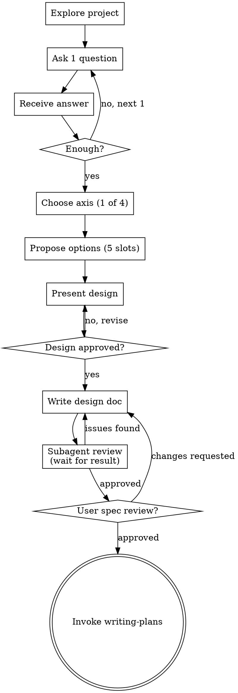

# Flirt: Pre-Commit Exploration (Deep-Kiss Series)

Turns ideas into fully formed designs and specs through natural collaborative dialogue. This is the *non-committal exploration* phase — before committing to implementation.

**Narrative**: `flirt` (explore) → `deep-kiss` (lock the design) → implement. This skill is the first step. When done, it leaves a spec document and hands off to `writing-plans`.

**F.L.I.R.T.** — 5-step mnemonic (matches the checklist)
- **F**ind intent — understand purpose, constraints, and success criteria
- **L**ist axes — pick 1 of 4 axes that fits the task
- **I**terate options — generate 2–3 KISS-locked options
- **R**efine slots — fill all 5 required slots (name / what / trade-off + cognitive debt / when / verification test)
- **T**est-spec — write the spec, self-review, get user approval

**Deep-Kiss Principle (applies to this entire series)**: Dig *deep* into intent and constraints, but every option you surface must stay *inside the KISS zone*. All options must be small. The difference between options is not "how big" but *"what kind of minimal"*.

Start by understanding the current project context. Refine the idea one question at a time. Once you understand what to build, present a design and get the user's approval.

<HARD-GATE>
Do NOT invoke any implementation skill, write any code, scaffold any project, or take any implementation action until you have presented a design and the user has approved it. No exceptions, even for seemingly simple projects.
</HARD-GATE>

<HARD-GATE>
During clarification, ask exactly 1 question per message. Do not ask follow-up questions or branch before receiving the user's answer. Do not bundle questions — a "scope question + content question" in one message is a violation. If more questions follow, send them in the *next message*. This discipline exists for consistency in small models.
</HARD-GATE>

## Meta-YAGNI: This Skill Follows Its Own Rules

This skill applies YAGNI to itself:

1. **Encode principles, not cases.** When a new scenario comes up, check whether existing principles already cover it. If not, add a *principle* — not a case catalog entry.
2. **Examples teach FORMAT, not SITUATIONS.** They are not a catalog of scenarios. Do not grow beyond 3.
3. **A small model reading this for the first time must be able to follow it.** When you spot vague phrasing or implicit assumptions, make them explicit.

## Anti-Pattern: "This Is Too Simple to Need a Design"

Every project goes through this process. A todo list, a single-function utility, a config change — all of them. *"Simple"* projects cause the most waste from unexamined assumptions. The design can be short (a few sentences for truly simple projects), but it must be presented and approved.

## Checklist

Create a task for each item and complete them in order:

1. **Explore project context** — files, docs, recent commits
2. **Clarifying questions (loop)** — *1 question per message*, receive answer → repeat until sufficient. Focus: purpose, constraints, success criteria.
3. **Choose an axis** — pick 1 of the 4 axes (scope / location / abstraction / removal)
4. **Propose 2–3 options** — using positions from the chosen axis, with all 5 slots filled
5. **Present the design** — scale length to complexity, get approval after each section
6. **Write the design document** — save to `docs/deep-kiss/specs/YYYY-MM-DD-<topic>-design.md` and commit
7. **Subagent spec review** — dispatch Task subagent using `spec-document-reviewer-prompt.md`; wait for result, fix any issues found
8. **User spec review** — ask the user to review the written spec
9. **Transition to implementation** — invoke the `writing-plans` skill

## Process Flow

**The terminal state is invoking `writing-plans`.** Do not invoke `frontend-design`, `mcp-builder`, or any other implementation skill. The *only* skill that follows flirt is `writing-plans`.

## The Process

### Understanding the Idea

- Start by checking the current project state (files, docs, recent commits)
- Before asking detailed questions, **assess scope**: if the request describes multiple independent subsystems (e.g., "a platform with chat + file storage + payments + analytics"), flag it immediately. Don't spend questions refining details of a project that first needs decomposition.
- If it's too large for a single spec, **decompose into sub-projects**: what are the independent parts, how do they relate, what order to build them in. Then flirt the first sub-project through the normal design flow. Each sub-project gets its own spec → plan → implementation cycle.
- For appropriately scoped projects, refine one question at a time
- Prefer multiple-choice questions when possible. Open-ended is also fine.
- **1 question per message** (HARD-GATE). If a topic is deep, spread across multiple *messages* — do not bundle.
- Focus: purpose, constraints, success criteria
- **Read information that is readable from code directly.** Only ask the user about intent, preferences, and constraints that cannot be found in the code.

### Exploring Options (KISS-Locked)

**Core principle**: Every option must stay inside the KISS zone. The difference between options is not "how much" but *"what kind of minimal"*. Options labeled "extensible", "future-proof", or "generic" are rule violations by definition.

#### Step 1: Choose 1 of 4 Axes

Determine the axis from the type of task. *All options within any axis stay inside the KISS zone.*

**Scope axis** — when the task is *adding/modifying* and the impact radius is the decision
- *Exact*: only what was requested, only one place. Adjacent code untouched.
- *Adjacent*: the requested change + 1–2 places that would break without it
- *Boundary*: the requested change + everything clearly in the same unit (same function, same short file)

**Location axis** — when *where* to put the new behavior is the decision
- *Inline*: solve it inside the existing function or block
- *Thin helper*: one small function in the same file
- *Isolated unit*: one new file, zero impact on anything else

**Abstraction axis** — when dealing with *repeating or growing* code
- *Inline repetition*: zero abstraction, write it twice (rule of three not yet reached)
- *Single helper*: wrap into one function
- *Single type/interface*: introduce one small type (KISS upper bound)

> ❗ Larger abstractions (generic base classes, plugin architectures, added abstraction layers) are not allowed as options. The three above are the KISS ceiling — **except when the "Rule of Named Two" exception applies (see below)**.

##### Abstraction Axis Exception: Rule of Named Two

The KISS ceiling on abstractions exists to prevent *vague future-proofing* (a YAGNI violation) — not to block *confirmed planned extensions*. If the following mechanical test passes, a larger abstraction (interface / factory) may be included as an option:

> **Rule of Named Two**: At this point in time, there must be ≥ 2 *specifically named* instances.
>
> - ✅ "Stripe OAuth2 now + Google and GitHub OAuth planned next" — 3 named instances
> - ✅ "MySQL adapter + migrating to Postgres next sprint" — 2 named instances
> - ❌ "extensible OAuth2" — 0 instances (*"extensible" is vague — fails immediately*)
> - ❌ "support multiple auth providers" — 0 instances ("multiple" / "various" fail the same way)
> - ❌ "add OAuth2 login" — 1 instance (single instance → abstraction not justified)

If the test is *ambiguous*, do not pass it. Ask the user: "What is the *specific name* of the second instance, and *when* is it planned?"

**When the test passes — 3-Stage Options**

The abstraction is justified, but *when to build it* is the decision. Instead of the 4 axes, present the following **3-Stage structure** (all 5 required slots still apply; the stage name goes in slot 1 "Name"):

- **Stage 0 — Seed**
  - *What*: first implementation only + a TODO comment marking where the second instance goes. Zero abstraction.
  - *When*: the second implementation is weeks away, or the first is likely to change shape before then
  - *Cognitive debt*: when adding the second instance next session, the abstraction design must also be decided at that point

- **Stage 1 — Thin interface + first implementation (default recommendation)**
  - *What*: 1 interface + first implementation. Second implementation comes next session.
  - *When*: the second implementation is confirmed as the *first task of the next session*. The second implementation naturally validates the interface shape.
  - *Cognitive debt*: next session must verify that the interface signature can express the second implementation's requirements — which are not yet fully known

- **Stage 2 — Interface + both implementations at once**
  - *What*: interface + both implementations in the same session
  - *When*: only when the user *explicitly* wants both in one session (risk of bloated context)
  - *Cognitive debt*: must track both implementation branches to completion in one session — not recommended for small models

Default recommendation is **Stage 1**. When the second implementation becomes the first task of the next session, the interface's validity is naturally verified, and cognitive debt stays focused on one implementation at a time.

**Short example — "Stripe OAuth2 login now, Google OAuth2 next session"**:
- *Stage 0*: one `stripeLogin()` function + a TODO comment at the top of the module (`// TODO: googleLogin to be added to this module next session`)
- *Stage 1 (recommended)*: `OAuthProvider` interface (`authorize()`, `getProfile()`) + `StripeProvider` implementation. Next session only needs to add `GoogleProvider`.
- *Stage 2*: `OAuthProvider` + `StripeProvider` + `GoogleProvider` all in this session (only if user explicitly requests it)

**Removal axis** — when the task is *cleanup/refactoring* (YAGNI enforced directly)
- *Delete only*: zero additions, remove only what is unnecessary
- *Delete + tidy*: remove, then simplify what remains
- *Delete + minimal replacement*: remove, then add the minimum replacement only where required

#### Step 2: YAGNI Keyword Blacklist

If any of these words appear in an option description, *rewrite the option immediately*:

> *future-proof, extensible, generic, reusable, configurable, pluggable, abstraction layer, framework*

These words are almost never justified. Treat them as a signal that the option has escaped the KISS zone.

#### Step 3: Number of Options — 2 or 3

Do not force 3 options for trivial tasks. Forcing a third option is itself the start of context bloat.

#### Step 4: Each Option Must Use This Exact Format

Do not change the labels. Any option with an empty slot must be rewritten before presenting.

**[Option Name]**
- What: [what changes, and where — 1 sentence]
- Trade-off: [what you give up — 1-2 sentences] *Cognitive debt*: [what you must keep in mind every time you revisit this code — phrased as "must keep X in mind every time"]
- When: [under what condition this option is the right choice — 1 sentence]
- Verification test: [1 concrete sentence describing the automated test that proves this behavior works]

"No trade-off" / "write a unit test" / "add integration tests" are evasion answers — rewrite. Manual verification exception: visual or system behaviors where automation is clearly impractical (UI flicker, OS theme sync, native dialogs). Even then, specify a minimum automated check (e.g., `npm run build`, type check).

#### How to Choose an Axis

When unsure which axis to use, ask yourself: what is the core decision in this task?

- "Where do I *put* the new code?" → **Location axis**
- "How much existing code do I *touch*?" → **Scope axis**
- "Should I *abstract* this repeating or growing code?" → **Abstraction axis**
- "Am I *removing* unused things?" → **Removal axis**

Once you've decided, write one sentence explaining *why this axis* **before** listing the options. If you cannot write that sentence, reconsider your choice.

> *Example: "Axis: Location — the core decision is whether to inline the filter logic into the existing method or extract it into a helper."*

#### How to Choose the Recommended Option

When labeling an option "(recommended)", **the middle option is not a default.** Derive the recommendation from what the user has actually described:

- One call site, simple logic → the simpler option may be right (even option A)
- A similar pattern already exists in the codebase → the option that follows that pattern
- A named extension is confirmed for the next session → check Rule of Named Two, then decide

If you cannot write one sentence explaining why X is recommended in *this specific context*, reconsider.

### Presenting the Design

- Once you understand what to build, present the design
- Scale each section to complexity: a few sentences for straightforward parts, 200–300 words for subtle ones
- After each section, ask: "Does this look right so far?"
- Cover: architecture, components, data flow, error handling, testing
- If something is off, be ready to go back and clarify

### Isolation and Clarity

- Decompose the system into small units, each with *one clear purpose*, communicating through well-defined interfaces, independently understandable and testable
- For each unit you must be able to answer: what does it do, how is it used, what does it depend on
- Can someone understand what a unit does without reading its internals? Can you change the internals without breaking consumers? If not, the boundary is wrong.
- A growing file is a *signal that it's doing too much*. Small units also benefit small models — they reason better over code that fits in context at once.

### Working in Existing Codebases

- Explore the current structure before proposing changes. Follow existing patterns.
- If existing code problems (e.g., an oversized file, unclear boundaries, tangled responsibilities) affect the current task, include *targeted improvements* in the design — the way a good developer would improve code while working in it.
- Do not propose unrelated refactoring. Stay focused on the current goal.

## After the Design

### Documentation

- Save the validated design (spec) to `docs/deep-kiss/specs/YYYY-MM-DD-<topic>-design.md`
  - (User's preferred spec location overrides this default)
- Use the `elements-of-style:writing-clearly-and-concisely` skill if available
- Commit the design document to git

### Subagent Spec Review

<HARD-GATE>
You MUST call the Agent tool to dispatch the reviewer. Do NOT review the spec inline — reading the spec yourself and making edits does not count. The adversarial reviewer must run as a separate agent. Do not proceed to the User Review Gate until the Agent tool call completes and any issues are resolved.
</HARD-GATE>

Call the **Agent tool** with:
- `subagent_type`: `"general-purpose"`
- `description`: `"Adversarial spec review"`
- `prompt`: the full contents of `spec-document-reviewer-prompt.md` in this directory, with `[SPEC_FILE_PATH]` replaced by the actual spec path

If the subagent returns issues, fix them in the spec document and call the Agent tool again.

### User Review Gate

After the subagent approves the spec, ask the user to review it:

> "I've written and committed the spec to `<path>`. Please review it and let me know if anything needs to change before I move on to writing the implementation plan."

Wait for their response. If changes are requested, make them and dispatch the subagent again. Only proceed after approval.

### Implementation Phase

- Invoke the `writing-plans` skill to generate a detailed implementation plan
- Do not invoke any other skill. `writing-plans` is the next and only step.

## Core Principles

- **One question per message (HARD-GATE)** — exactly 1 per message. Follow-ups go in the next message.
- **Prefer multiple-choice** — easier for users than open-ended when options are known
- **YAGNI/KISS ruthlessly** — all options inside the KISS zone. No escape hatches ("ambitious", "extensible", "future-proof")
- **2–3 options, from the 4 axes only** — no free-form generation. Use only the positions defined within the chosen axis.
- **State cognitive debt** — every trade-off must include the ongoing mental cost the user carries
- **Verification tests are mandatory** — each option must name a concrete automated test that proves the behavior. Block the "ship it and break the build" pattern at the options stage.
- **Incremental validation** — get approval before moving to the next section
- **Stay flexible** — if something is off, go back and clarify
